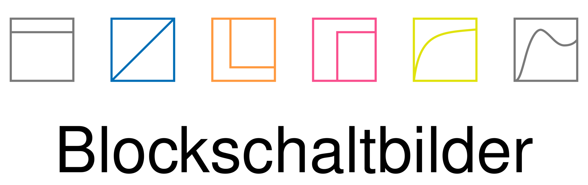

_Einfache Blockschaltbilder in LaTeX/TikZ_


[](https://travis-ci.org/mp4096/blockschaltbilder)
[](https://coveralls.io/github/mp4096/blockschaltbilder?branch=master)


## Installation
Einfach die Datei `src/blockschaltbilder.tex` in das Dokument hinzufügen, z.B.:

```tex
\input{<Pfad zum Verzeichnis mit der Datei>/blockschaltbilder}
```

Anwendungsbeispiele für die Makros sind in der Datei `examples/_examples.tex` zu finden.


## Verfügbare Makros
| Makro                                       | Beispiel                                                                                                     |
|:--------------------------------------------|:-------------------------------------------------------------------------------------------------------------|
| Verzweigung (`\Verzweigung`)                |                                                                                                              |
| Summationsstelle (`\Summationsstelle`)      |                 |
| Allgemeine Übertragungsfunktion (`\UeFunk`) |  |
| M-Glied - Punktsymbol (`\MGlied`)           |            |
| M-Glied - Kreuzsymbol (`\MGliedVar`)        |            |
| P-Glied (`\PGlied`)                         |                          |
| I-Glied (`\IGlied`)                         |                          |
| D-Glied (`\DGlied`)                         |                          |
| Totzeitglied (`\TZGlied`)                   |                     |
| PT1-Glied (`\PTEinsGlied`)                  |                        |
| PT2-Glied (`\PTZweiGlied`)                  |                        |
| Zusätzliche Ein- und Ausgänge (`\NeueEA`)   |    |
| Kennlinienglied (`\KLGlied`)                |                  |
| Sättigung (`\Saettigung`)                   |                        |


## Argumente
`\Verzweigung[<1>]{<2>}{<3>}{<4>}`

1. Optionale TikZ-Eigenschaften (z.B. Farbe)
* Name des TikZ-Knotens (`node`)
* Position
* Größe

`\Summationsstelle[<1>]{<2>}{<3>}{<4>}`

1. Optionale TikZ-Eigenschaften (z.B. Farbe)
* Name des TikZ-Knotens (`node`)
* Position
* Größe

`\UeFunk[<1>]{<2>}{<3>}{<4>}{<5>}`

1. Optionale TikZ-Eigenschaften (z.B. Farbe)
* Name des TikZ-Knotens (`node`)
* Position
* Größe
* Inhalt des Knotens

`\MGlied[<1>]{<2>}{<3>}{<4>}{<5>}`, `\MGliedVar[<1>]{<2>}{<3>}{<4>}{<5>}`

1. Optionale TikZ-Eigenschaften (z.B. Farbe)
* Name des TikZ-Knotens (`node`)
* Position
* Größe
* Verstärkung `K`

`\PGlied[<1>]{<2>}{<3>}{<4>}{<5>}`, `\IGlied[<1>]{<2>}{<3>}{<4>}{<5>}`, `\DGlied[<1>]{<2>}{<3>}{<4>}{<5>}`

1. Optionale TikZ-Eigenschaften (z.B. Farbe)
* Name des TikZ-Knotens (`node`)
* Position
* Größe
* Verstärkung `K`

`\TZGlied[<1>]{<2>}{<3>}{<4>}{<5>}{<6>}`

1. Optionale TikZ-Eigenschaften (z.B. Farbe)
* Name des TikZ-Knotens (`node`)
* Position
* Größe
* Verstärkung `K`
* Totzeit `T_t`

`\PTEinsGlied[<1>]{<2>}{<3>}{<4>}{<5>}{<6>}`

1. Optionale TikZ-Eigenschaften (z.B. Farbe)
* Name des TikZ-Knotens (`node`)
* Position
* Größe
* Verstärkung `K`
* Zeitkonstante `T`

`\PTZweiGlied[<1>]{<2>}{<3>}{<4>}{<5>}{<6>}`

1. Optionale TikZ-Eigenschaften (z.B. Farbe)
* Name des TikZ-Knotens (`node`)
* Position
* Größe
* Verstärkung `K`
* Zeitkonstante `T` und Dämpfung `d`

`\NeueEA{<1>}{<2>}{<3>}{<4>}{<5>}`

1. Name des Blocks, zu dem neue Ports hinzugefügt werden sollen
* Anzahl von neuen Ports oben, > 0. Diese Ports heißen `<1>--north N`, wobei `N = 1, 2, ...`
* Anzahl von neuen Ports rechts, > 0. Diese Ports heißen `<1>--east N`, wobei `N = 1, 2, ...`
* Anzahl von neuen Ports unten, > 0. Diese Ports heißen `<1>--south N`, wobei `N = 1, 2, ...`
* Anzahl von neuen Ports links, > 0. Diese Ports heißen `<1>--west N`, wobei `N = 1, 2, ...`

`\KLGlied[<1>]{<2>}{<3>}{<4>}{<5>}{<6>}{<7>}`

1. Optionale TikZ-Eigenschaften (z.B. Farbe)
* Name des TikZ-Knotens (`node`)
* Position
* Größe
* Beliebige Zeichenbefehle, das verfügbare Feld ist skaliert auf +/- 1 (siehe Beispiel)
* Beschriftung oben links
* Beschriftung oben rechts

`\Saettigung[<1>]{<2>}{<3>}{<4>}{<5>}{<6>}`

1. Optionale TikZ-Eigenschaften (z.B. Farbe)
* Name des TikZ-Knotens (`node`)
* Position
* Größe
* Beschriftung oben links
* Beschriftung oben rechts

Für weitere Informationen siehe `_examples.tex`.


## Benutzung mit TikzEdt
Falls man TikzEdt oder andere WYSIWYG-Tools benutzt, kann es sinnvoll sein,
die Definition der Koordinaten und die Definition der Blöcke zu trennen, z.B.:

```tex
\coordinate (i glied 1) at (0, 0);
\coordinate (i glied 2) at (3, 0);

\IGlied{i glied 1}{i glied 1}{1 cm}{}
\IGlied{i glied 2}{i glied 2}{1 cm}{}

\draw[thick, -latex'] (i glied 1) -- (i glied 2);
```

Obwohl diese Syntax umständlicher aussieht, hat sie den Vorteil,
dass die Koordinaten als solche vom TikzEdt-Parser erkannt werden.
Die werden also im Overlay markiert und man kann in der Vorschau Blöcke interaktiv positionieren.


## Boilerplate-Code-Generator
Um den Tippaufwand zu reduzieren, kann man den mitgelieferten
Boilerplate-Code-Generator verwenden. Die ausführlichere Dokumentation können Sie
[hier](https://github.com/mp4096/blockschaltbilder/blob/master/docs/boilerplate.md)
nachlesen. 


## Empfohlene Größen
| Element                         | Größe    | TikZ-Eigenschaften                                |
|:--------------------------------|:---------|:--------------------------------------------------|
| Verzweigung (skalar)            | `2 pt`   |                                                   |
| Verzweigung (vektoriell)        | `4 pt`   |                                                   |
| Summationsstelle                | `0.4 cm` |                                                   |
| Vordefinierter Block            | `1 cm`   |                                                   |
| Allgemeine Übertragungsfunktion | `1 cm`   | _optional:_ `inner sep = 8 pt`                    |
| Skalarer Signalfluss            |          | `thick, -latex` oder `thick, -latex'`             |
| Vektorieller Signalfluss        |          | `ultra thick, -latex` oder `ultra thick, -latex'` |
